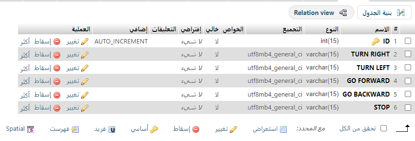

# FirstTaskControlPanel

1.installing XAMPP and create a database called 'nouratask1', and a table called 'controlpanel'.

2.creating a user for the database with the following information : User name,Server name,and password:
```
$conn = mysqli_connect ("localhost", "root","","nouratask1");
```

3.create DB in phpMyAdmin :

